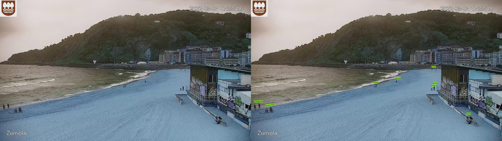

# People detection

Wondering how crowded is your favourite beach of Gipuzkoa (Basque Country)?



## Model

Based on [`pix2seq`](https://github.com/google-research/pix2seq), currently using ResNet-50 pretrained model, COCO object detection fine-tuned checkpoints.

## Accuracy

Despite of being quite accurate out-of-the-box model, it fails sometimes. This is because the  camera is too far from the people. This could be handled fine-tuning the model, but it would be a time consuming task... As a baseline, it is okay.

# Installation

Clone the repository and the submodules with
```shell
$ git clone --recurse-submodules https://github.com/r3v1/crowded_beach.git
```

and finally, install the requirements (recommended using a virtual environment):
```shell
$ pip install -r requirements.txt
```

## Download models

Just run the Makefile in the root:
```shell
$ make download_checkpoints
```

# Running

Example of counting people in Kontxa beach with a threshold of 0.5, saving frames every 15 seconds:

```shell
$ python src/predict.py -b Kontxa -s -t 0.5 -d 15
```

# Similar projects

- [Surfer Counter](https://surfercounter.com/)
